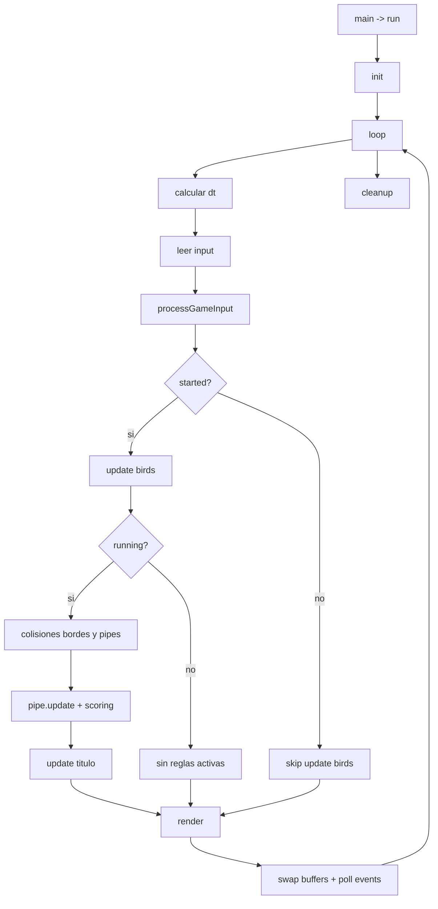

# Flappy Bird (OpenGL + LWJGL) - Flujo Explicativo Detallado

Este documento explica **como funciona el juego a nivel de codigo**, siguiendo el flujo real de las clases en `com.graphics.flappybird`.

## 1) Arquitectura general

Clases y responsabilidad principal:

- `AppFlappyBird`: orquesta todo (init, loop principal, render, reset, cleanup).
- `GameState`: estado global de partida (iniciada, game over, vivos, puntajes).
- `InputManager`: traduce teclado a acciones de alto nivel (`spacePressed`, `wPressed`, `rPressed`).
- `Bird`: fisica de cada pajaro (gravedad, salto, posicion, animacion visual).
- `Pipe`: sistema de tuberias (spawn, movimiento, scoring, colisiones).
- `Renderer`: capa OpenGL (shaders, quad base, drawRect, uniforms).

## 2) Punto de entrada y arranque

En `AppFlappyBird.main()` se crea la app y se llama `run()`:

1. `init()`
2. `loop()`
3. `cleanup()`

### 2.1 init()

`init()` prepara GLFW/OpenGL y objetos del juego:

1. Inicializa GLFW.
2. Configura ventana OpenGL 3.3 Core Profile.
3. Crea ventana `900x700` y activa VSync (`glfwSwapInterval(1)`).
4. Crea capacidades OpenGL con `GL.createCapabilities()`.
5. Inicializa `Renderer` (`renderer.init()`):
   - compila shaders,
   - crea un VAO/VBO con un quad unitario.
6. Crea entidades:
   - `bird1 = new Bird(-0.55f)`
   - `bird2 = new Bird(-0.35f)`
   - `pipe = new Pipe()`
   - `inputManager = new InputManager(window)`
   - `gameState = new GameState()`
7. Actualiza titulo de ventana con puntajes y mensaje de estado.

## 3) Bucle principal (`loop`) frame a frame

Cada iteracion del while representa **un frame**:

### 3.1 Delta time

- `dt = ahora - ultimoTiempo`
- Se limita a `0.033f` (aprox 30 FPS minimo logico) para evitar saltos grandes si el frame se congela.

### 3.2 Input

`inputManager.processInput()`:

- `ESC`: cierra ventana.
- `SPACE` (flanco de subida): `spacePressed = true`.
- `W` (flanco de subida): `wPressed = true`.
- `R` (flanco de subida): `rPressed = true`.

Importante: se usa deteccion por cambio (`prevKey`) para no disparar salto continuo si la tecla queda presionada.

### 3.3 Traduccion de input a acciones de juego

`processGameInput(action)` hace:

- Si `W`:
  - si hay game over: `resetGame()`
  - si no inicio: `gameState.start()`
  - si jugador 1 vivo: `bird1.jump()`
- Si `SPACE`:
  - si hay game over: `resetGame()`
  - si no inicio: `gameState.start()`
  - si jugador 2 vivo: `bird2.jump()`
- Si `R` y game over: `resetGame()`

Resumen control actual:

- Jugador 1: `W`
- Jugador 2: `SPACE`

### 3.4 Actualizacion de pajaros

Antes de actualizar, calcula visibilidad:

- `p1Visible = alive1 || bird1.getBottom() > OFFSCREEN_Y`
- `p2Visible = alive2 || bird2.getBottom() > OFFSCREEN_Y`

`OFFSCREEN_Y = -1.2f`.

Si el juego ya inicio (`isStarted()`), cada pajaro visible ejecuta `bird.update(dt)`.

### 3.5 Reglas de juego (solo si esta corriendo)

`isRunning()` equivale a: `started && (alive1 || alive2)`.

Para cada jugador vivo:

1. Colision con bordes verticales:
   - muere si `top >= 1.0f` o `bottom <= -1.0f`.
2. Colision con tuberias:
   - `pipe.checkCollision(bird)` -> si true, muere.

Luego:

3. `pipe.update(dt, bird1.getX(), bird2.getX())`:
   - mueve tuberias,
   - crea nuevas por tiempo,
   - calcula puntos por jugador,
   - elimina tuberias fuera de pantalla.
4. Si jugador sigue vivo y gano puntos en ese frame, suma en `GameState`.
5. Actualiza titulo de ventana con puntajes/mensaje.

### 3.6 Render y fin de frame

1. `render()`
2. `glfwSwapBuffers(window)`
3. `glfwPollEvents()`

## 4) Fisica del pajaro (`Bird`)

Variables clave:

- `GRAVEDAD = -1.9f`
- `IMPULSO_SALTO = 0.85f`
- `VELOCIDAD_MAX_CAIDA = -1.8f`

En `update(dt)`:

1. `birdVelY += GRAVEDAD * dt`
2. clamp de caida: `birdVelY >= VELOCIDAD_MAX_CAIDA`
3. `birdY += birdVelY * dt`
4. `animTime += dt` (solo animaciones visuales)

En `jump()`:

- `birdVelY = IMPULSO_SALTO`

No suma impulso incremental: cada salto fija velocidad vertical a 0.85.

## 5) Tuberias (`Pipe`)

Constantes principales:

- `TUBERIA_ANCHO = 0.18f`
- `GAP_ALTO = 0.48f`
- `VELOCIDAD_TUBERIAS = 0.62f`
- `TIEMPO_ENTRE_TUBERIAS = 1.5f`
- centro gap aleatorio en `[-0.45, 0.45]`

### 5.1 Spawn

Cada `TIEMPO_ENTRE_TUBERIAS` segundos:

- crea `Tuberia(1.2f, gapCentroAleatorio)`

Nace fuera de la derecha para entrar al viewport luego.

### 5.2 Movimiento y limpieza

Cada frame:

- `t.x -= VELOCIDAD_TUBERIAS * dt`
- si `t.x + ancho/2 < -1.3f` -> se elimina

### 5.3 Scoring

Por cada tuberia y jugador:

- si el borde derecho de la tuberia queda atras de la X del pajaro
- y aun no fue puntuada para ese jugador
- suma 1 y marca `puntuada1`/`puntuada2`

Cada tuberia puede dar punto independiente a cada jugador.

### 5.4 Colisiones

`checkCollision(bird)` recorre tuberias y evalua:

- cuerpo del pajaro (AABB)
- pico (AABB)
- cada segmento de cola (AABB)

Logica base:

1. valida solape en X con la tuberia.
2. si hay solape X, hay colision si el rectangulo esta fuera del gap:
   - `top > gapTop` o `bottom < gapBottom`

## 6) Render OpenGL (`Renderer` + `AppFlappyBird.render`)

### 6.1 Shader y geometria

`Renderer` usa:

- Vertex shader con uniforms:
  - `uOffset` (posicion)
  - `uScale` (tamano)
  - `uTime` y `uWobble` (ondulacion)
- Fragment shader: color plano `uColor`

Geometria base: 1 quad (2 triangulos). Todo se dibuja reusando `drawRect(...)` cambiando uniforms.

### 6.2 Secuencia de dibujado por frame

En `render()`:

1. `beginRender()` limpia fondo celeste y activa shader/VAO.
2. pasa tiempo actual al shader (`setTime`).
3. dibuja todas las tuberias (`pipe.getSegmentosRender()`).
4. dibuja pajaros visibles (`drawBird`).
5. si `gameOver`, dibuja overlay oscuro horizontal.
6. `endRender()` desbindea VAO.

`drawBird` dibuja por partes:

- cola (segmentos cuadrados)
- cuerpo (con wobble)
- pico
- alas (alto variable segun `getFlap()`)
- ojo y pupila

## 7) Estado del juego (`GameState`)

Campos:

- `puntaje1`, `puntaje2`
- `alive1`, `alive2`
- `started`
- `gameOver`

Reglas:

- `reset()`: deja todo en inicio.
- `start()`: marca partida iniciada.
- `killPlayer(n)`: marca muerto y si ambos mueren -> `gameOver = true`.
- `isRunning()`: iniciado y al menos uno vivo.

Mensajes de UI (titulo):

- No iniciado: `W o SPACE para empezar`
- Game over: `GAME OVER - W o SPACE o R para reiniciar`

## 8) Flujo resumido (mermaid)

## 9) Detalles importantes para comprender el comportamiento actual

- El sistema usa coordenadas NDC (`-1` a `1`) para logica y render.
- El juego empieza en estado pausado hasta `W` o `SPACE`.
- Cuando un jugador muere, puede seguir cayendo y renderizando hasta salir por debajo de `OFFSCREEN_Y`.
- El puntaje solo se suma si el jugador sigue vivo en ese frame.
- En `render()` hay una duplicacion: el pajaro puede dibujarse dos veces si esta vivo (primero por visibilidad y luego por `isAlive`). Visualmente casi no cambia, pero es costo extra de draw.

## 10) Reset completo de partida

`resetGame()` llama:

1. `gameState.reset()`
2. `bird1.reset()`
3. `bird2.reset()`
4. `pipe.reset()`
5. `updateWindowTitle()`

Deja el juego listo para iniciar otra ronda.
